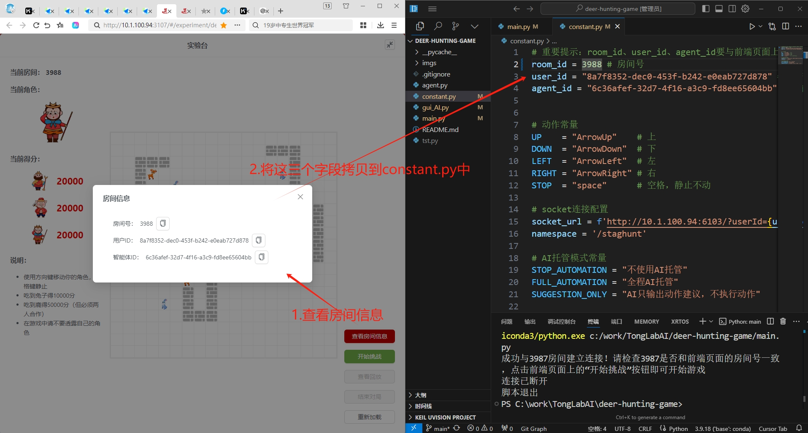
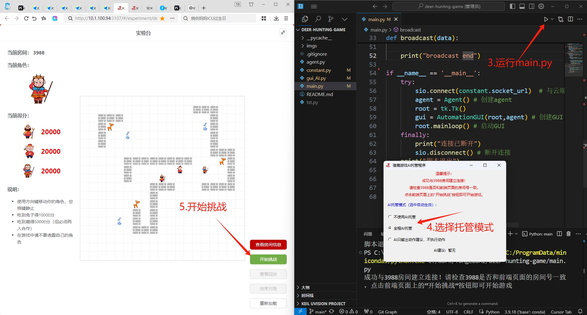

# 猎鹿游戏AI托管程序使用文档

# 环境配置
python3.9

pip install -r requirements.txt

# AI托管程序连通性测试

1. 进入tonglab猎鹿游戏的前端页面（先不要点击开始游戏）。
2. 点击查看房间信息，将房间号、用户ID、智能体ID拷贝到constant.py文件中。将ip_port修改为实验手册中提供的ip_port。
3. 运行main.py，会弹出一个窗口，默认开启全程AI托管。
4. 浏览器点击开始挑战，如果用户可以看到AI托管程序能操作前端页面进行游戏，则说明AI托管程序连通性正常。

# AI托管程序策略开发
学生重点关注agent.py文件：
- lst_env_data：存储每一轮的环境数据，用于动作规划。
- take_action：根据环境数据规划动作。
学生需要修改该文件，实现自己的策略。

