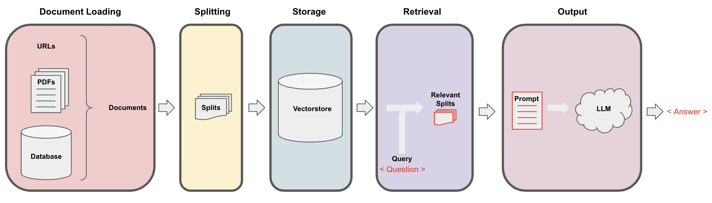

# rag-demo

# 概述
该项目对RAG基本概念进行介绍和代码实践。我们将基于`LangChain`框架和外部数据完成一个基于RAG 的问答系统原型。




## TongGPT
该项目使用通研院内部TongGPT API key，你可以通过 http://infra.pages.mybigai.ac.cn/tonggpt/ 申请并获取自己的API key

***本项目为实现更好的教学与使用效果，在repo中存放了默认`API KEY`与配置文件，仅做教学与实验使用***

***请不要在公开项目中泄漏自己的API KEY***

# 配置
```
conda create -n rag-demo python=3.12
conda activate rag-demo
pip install -r requirements.txt
```

# Reference
本项目中的代码与图片参考和修改自 https://www.deeplearning.ai/short-courses/langchain-chat-with-your-data/
